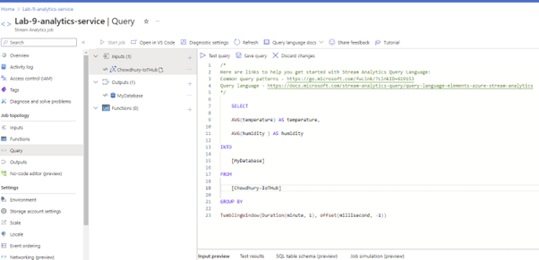

# Implementing Real-time Internet of Things (IoT) Data Streaming with Azure Stream Analytics

## Overview
In the provided IOT_DATA STREAMING folder we have 4 python scripts. Two of them are sensor.py and app.py. 
In sensor.py script, there is a read function where it is generating a random value of temperature and humidity. This is just for simulation purposes. In real life those readings directly come from real IoT devices.

The app.py script loads environment variable from a .env file. The environment variable here is the connection string.

For the app.py script to retrieve the connection string from a .env file, we need to create a .env file and stored the environment variable (connection string) there. A connection string is a string of characters that contains the information necessary for a device or an application to establish a connection with the IoT Hub service. We will get the connection string from Azure IoT hub which we are going to create next in Azure portal.

### Step 1: Sending Data from IoT device to IoT Hub

1. Go to the [Azure Portal](https://portal.azure.com/).
2. Create a new Azure IoT Hub.
   - Provide a unique name for your IoT Hub.
   - Choose the appropriate pricing and resource group settings.
   - Review and create the IoT Hub.

3. Navigate to the overview page of the IoT hub in Azure Portal.
4. Select "Devices" from the left-hand menu.
5. You need to register the device. To do that click on the "+ Add Device" button to add a new IoT device. Then you need to give it an ID, for example I have given the ID as 'sensor-1'.

6. Now click on the 'sensor-1' to see the details. Then copy the "primary connection string".

7. Paste the connection string to .env file in VScode.

This is the key that the client will use the the IT device is going to use the shared access key to create a token, a token called the Shared Access Signature (SAS) Token which going to be used to to to communicate with the Azure IoT.

8. Next, we need to RUN python file $app.py$ and IoT clients will start sending data to IoT hub

## Step-2 : Connecting Azure IoT Hub to Stream Analytics Service
We need to create Stream Analytics Job service in Azure and provide the input from IoT hub.
1. Create Stream analytics job in azure portal 

2. Navigate to "inputs" from left menu and click on "+ Add input". Select IoT Hub from the dropdwon menu.

3. Configure Input in IoT Hub , select the subscription and name of the IoT hub as your preefrence. Save the configuration.

You can review the Input Data by navigating to "Query" and selecting "Inputs"

## Step- 3: Sending the output of Stream Analytics to SQL Database
1. Create SQL Database. While creating SQL database we need to create a SQL server. Also we need to use SQL authentication as shown in the pictures.

2. Configure the server as shown in the picture.

3. Next we will connect the database from VScode.
4. Insatll SQL server extension in VScode if not already installed. Then navigate to SQL server extension -> add a connection -> input server name and database name-> SQLlogin credentials. Provide the credentials and you should see the databse apperars in the VScode. I provided the server’s name as server1chowdhury.database.windows.net. got from Azure SQL Server.
5. Select your database and click on "New Query"

6. Create a table for the telemetry data. You can use the code from CreateTable temeletry Data. Then run the SQL code.

7. Refresh the table under the databse and you shoud see the new table.

8. Finally we need to configure output of Stream analytics service. Go back to Stream anaytics service. Select 'Outputs' from left menu and click '+ Add Output'. Then select SQL database as output. Configure SQL as shown in the picture.

9. Next, we need to add Query in the analytics service. This query groups the IoT Data in a fixed window size which is every 1 minute and take the average of that data. We can change the window size as we want. For example, we can change it to TumblingWindow(second, 5) to group the data every 5 secs and the average would be calculated for each 5-second interval

We can modify the sample rate in the app.py script to get the reading faster or slower.  
Now the input is configured to get data from IoT Hub, and output is configured to send the data to SQL database, next we Start Job in Stream analytics
10. Go to the stream analytics in azure portal and click on "Start Job".

11. Run the python code in VScode and you should see the Table is being loaded with the data.By starting the stream nalytics , it has started prcossing the data from IoT hub and sending it to SQL data base. We can save the data in CSV file and use it offline.

### Step- 4: Connecting SQL database to Power BI
1. Insatll and open Power BI.
2. Choose "Database" from left menu Login to SQL server database with your credentials. Then click on "Connect"

3. You can visualize your data from IoT devices in the dashboard. 

4. On the right hand menu you can see X-axis and Y axis. You can drag and drop the 'Telemetry DataID' in X-axis and 'Sum of Tempature' and 'Sum of humidity' in the Y-axis.

5. Then you can see the live data in the Dashboard that is being sending from IoT device. We need to keep the python code app.py running so that it adds real time data in the SQL database, and we can see the real time update of data in Power BI
6. We can visualize the following in real time in Power BI Dashboard 
   - Sum of Temperature and Humidity in line graph
   - Max and min temperature in Donut Chart

