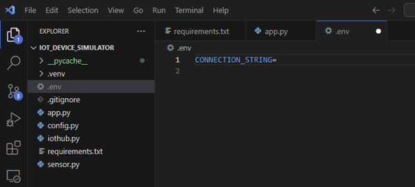

# Implementing Real-time Internet of Things (IoT) Data Streaming with Azure Stream Analytics

## Setting Up
 If we look at the `sensor.py` script in this github repository we will see that a `read` function generates random values for temperature and humidity, simulating IoT device readings. In a real-world scenario, these readings would come directly from IoT devices.

The `app.py` script loads environment variables from a `.env` file, with the primary variable being the connection string.

To facilitate the retrieval of the connection string in `app.py`, we create a `.env` file to store the environment variables. The connection string, a string of characters containing information necessary for a device or application to establish a connection with the IoT Hub service, is obtained from the Azure IoT Hub, which we create in the following steps.

## Step 1: Sending Data from IoT Device to IoT Hub

1. Go to the [Azure Portal](https://portal.azure.com/).
2. Create a new Azure IoT Hub.
   - Provide a unique name for your IoT Hub.
   - Choose the appropriate pricing and resource group settings.
   - Review and create the IoT Hub.

3. Navigate to the overview page of the IoT hub in Azure Portal.
4. Select "Devices" from the left-hand menu.
5. Register the device by clicking on "+ Add Device" and assigning it an ID (e.g., 'sensor-1').

6. Copy the "primary connection string" from the 'sensor-1' details.

7. Paste the connection string into the `.env` file in VSCode.

This connection string is crucial as the client uses it to generate a Shared Access Signature (SAS) Token, which is used for communication with Azure IoT.

8. Run the Python file `app.py`, and IoT clients will start sending data to the IoT Hub.

## Step 2: Connecting Azure IoT Hub to Stream Analytics Service
We need to create a Stream Analytics Job service in Azure and provide input from the IoT hub.
1. Create a Stream Analytics job in the Azure portal.

2. Navigate to "inputs" from the left menu and click on "+ Add input". Select IoT Hub from the dropdown menu.

3. Configure Input in IoT Hub, selecting the subscription and the IoT hub name as preferred. Save the configuration.

Review the input data by navigating to "Query" and selecting "Inputs."

## Step 3: Sending the Output of Stream Analytics to SQL Database
1. Create a SQL Database. While creating the SQL database, create a SQL server, and use SQL authentication, as shown in the pictures.

2. Configure the server as shown in the picture.

The databse should look like the following: 

3. Next we need to connect SQL database in VSCode. Install the SQL server extension in VSCode if not already installed. Navigate to the SQL server extension, add a connection, input server name and database name, and provide SQL login credentials. Upon providing the credentials, you should see the database appear in VSCode. I named the server as `server1chowdhury.database.windows.net` obtained from Azure SQL Server.
4. Select your database and click on "New Query."

5. Create a table for telemetry data using the code from "CreateTableTelemetryData." Run the SQL code.

6. Refresh the table under the database, and you should see the new table.

7. Go back to Stream Analytics service, select 'Outputs' from the left menu, and click '+ Add Output'. Then select SQL Database as the output. Configure SQL as shown in the picture.

8. Add a query in the analytics service. This query groups IoT data in fixed window size (e.g., every 1 minute) and calculates the average. You can modify the window size and sample rate in the `app.py` script.

9. With input configured to get data from IoT Hub and output configured to send data to the SQL database, start the job in Stream Analytics. Go to Stream Analytics in the Azure portal and click on "Start Job."

10. Run the Python code in VSCode, and you should see the table loading with data. By starting the Stream Analytics, it processes the data from IoT hub and sends it to the SQL database. You can save the data in a CSV file for offline use.

## Step 4: Connecting SQL Database to Power BI
1. Install and open Power BI.
2. Choose "Database" from the left menu, login to SQL server database with your credentials, and click on "Connect."

3. Visualize data from IoT devices in the dashboard.

4. On the right-hand menu, drag and drop 'Telemetry DataID' into X-axis and 'Sum of Temperature' and 'Sum of Humidity' into Y-axis.

5. Observe live data in the dashboard sent from the IoT device. Keep the `app.py` code running to add real-time data to the SQL database for continuous updates in Power BI.
6. Visualize real-time data in Power BI Dashboard, including:
   - Sum of Temperature and Humidity in a line graph
   - Max and min temperature in a Donut Chart

