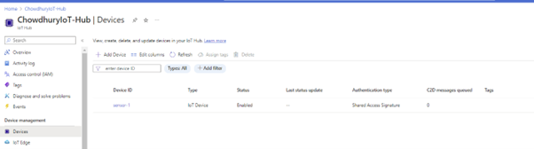

# End-to-End IoT Solution Implementation with Cloud Integration

## Overview

### Step 1: Azure IoT Hub Setup

1. Go to the [Azure Portal](https://portal.azure.com/).
2. Create a new Azure IoT Hub.
   - Provide a unique name for your IoT Hub.
   - Choose the appropriate pricing and resource group settings.
   - Review and create the IoT Hub.

### Step 2: Registering IoT Device

1. Navigate to your newly created IoT Hub in the Azure Portal.
2. Select "IoT devices" from the left-hand menu.
3. Click on the "+ Add" button to add a new IoT device and Enter the device name as "sensor1" or your preferred name.
   

## Step 3: Sending Data from IoT Device to IoT Hub

Now that you have your IoT Hub set up and the device registered, you can start sending data from your IoT device to the IoT Hub.

- Implement the necessary code on your IoT device to send data to the Azure IoT Hub.
- Ensure that the IoT device is properly connected and authorized.