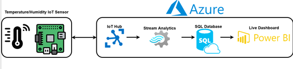

<!--readme-->
In this hands-on lab, I've implemented a comprehensive IoT solution that simulates device interactions, processes real-time data, and visualizes insights using Python code in the VSCode editor.

## Technologies Used

- **IoT Device Simulator (Client):**
  Created an IoT device simulator using Python to emulate device behaviors and interactions.

- **Azure IoT Hub:**
  Used for device management and communication, including setting up and configuring IoT Hub.

- **Azure Stream Analytics:**
  Created a Stream Analytics job with a customized query for real-time data processing from IoT devices.

- **Azure SQL Database:**
  Created and configured an Azure SQL Database to securely store processed IoT data.

- **Power BI:**
  Designed and implemented live dashboards using Power BI to visualize and analyze IoT data.

## Objective Overview

The lab's objective is to establish an end-to-end IoT solution, including device simulation, real-time data processing, and data visualization. The technologies mentioned above work together seamlessly to achieve this objective.

## System Diagram

## Acknowledgments

I would like to express my gratitude to Professor Dr. Mohamed Ramy for his valuable teaching, guidance, and the foundational code provided during the real-time data course.